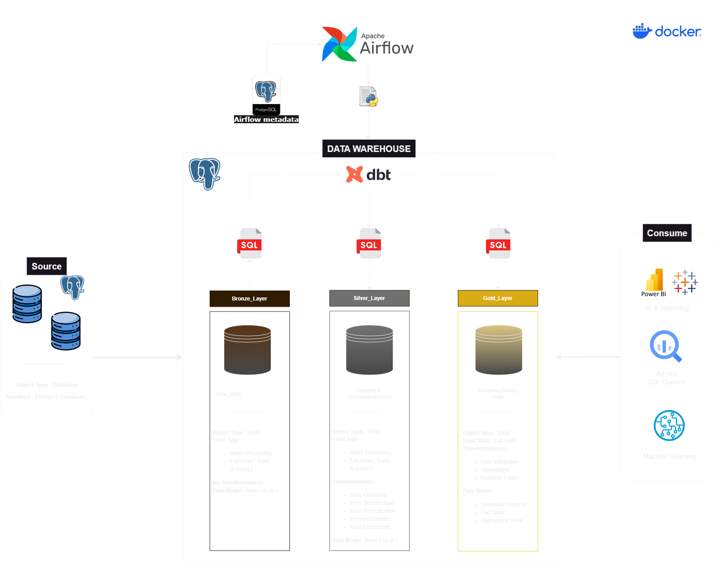
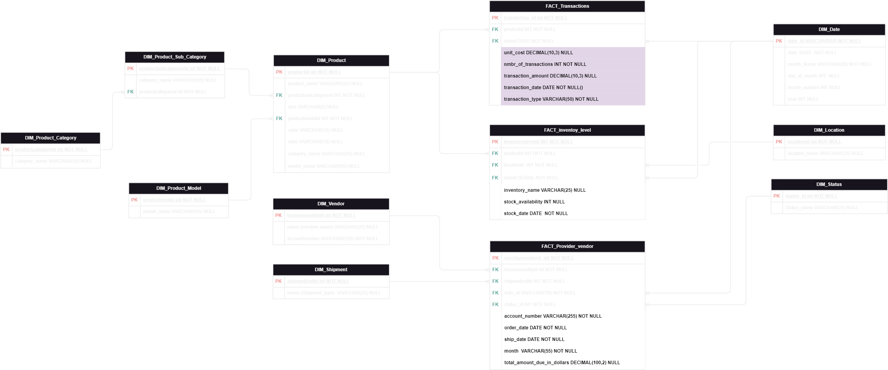

# 📊 Inventory Management Data Warehouse

## Overview

This project implements a comprehensive Inventory Management Data Warehouse solution using modern data engineering tools.
The architecture leverages industry-standard technologies to transform raw inventory data into business-ready insights through efficient processing and transformation pipelines.

---

## Business Value
The solution enables enterprise-wide inventory optimization while maintaining scalability through:
- Centralized inventory data management and analytics
- Automated data processing workflows with scheduled updates
- Comprehensive data modeling for business intelligence
- Containerized architecture for simplified deployment

This modern data engineering approach accelerates inventory insights while providing reliable data processing, positioning your organization to optimize stock levels, analyze product performance, and gain deeper insights into your inventory operations.

---

## 📌 High-Level Architecture

- **Core Components**:  
  - **dbt (data build tool)**: Data transformation engine
  - **Apache Airflow**: Workflow orchestration and scheduling
  - **PostgreSQL**: Primary database for data storage
  - **Docker**: Containerization for consistent deployment

- **Pipeline Flow**:
  - Data ingestion from various sources
  - Data cleaning and standardization
  - Transformation using dbt models
  - Loading into dimensional data warehouse

- **Consumption Methods**:
  - BI and Reporting Tools
  - Inventory Analytics Dashboards
  - Business Intelligence Applications

---

## 🔄 Data Warehouse Schema

The data warehouse follows a dimensional modeling approach optimized for inventory management analytics:

- **Fact Tables**:
  - Inventory transactions
  - Stock movements
  - Purchase orders

- **Dimension Tables**:
  - Products
  - Suppliers
  - Locations
  - Time dimensions

**Key Relationships**:
- Products link to inventory transactions
- Locations provide geographical context
- Suppliers connect to product sourcing
- Time dimensions enable trend analysis across different periods

---

## 🔥 Data Pipeline Components

The data pipeline is structured into several key components:

### Data Ingestion
- Raw data is extracted from multiple source systems
- Connectors handle various data formats and protocols
- Initial validation ensures data quality

### Data Transformation (dbt)
- Data is cleaned, standardized, and transformed
- dbt models implement business logic and relationships
- Transformations include:
  - Data normalization
  - Business rule application
  - Dimensional modeling

### Workflow Orchestration (Airflow)
- DAGs (Directed Acyclic Graphs) coordinate pipeline execution
- Scheduled jobs ensure timely data updates
- Dependencies between tasks are clearly defined

**Highlights**:
- **Modularity**: Separate concerns between ingestion, transformation, and loading
- **Scalability**: Handles growing data volumes efficiently
- **Maintainability**: Clear separation of concerns with documented transformations

---

## 📂 Component Descriptions

| Component     | Description                           | Purpose                      | Key Capabilities                                   |
| :------------ | :------------------------------------ | :--------------------------- | :------------------------------------------------- |
| **dbt**       | Data transformation tool              | Data Modeling & Transformation | SQL-based transformations, Testing, Documentation |
| **Airflow**   | Workflow orchestration platform       | Pipeline Orchestration       | Task scheduling, Dependency management, Monitoring |
| **PostgreSQL**| Relational database                   | Data Storage                 | ACID compliance, SQL querying, Indexing           |
| **Docker**    | Containerization platform             | Deployment & Environment     | Isolation, Consistency, Portability               |

---

## 🛠️ Implementation Details

### dbt Models
- Modular transformation logic organized by business domain
- Test coverage ensuring data quality and integrity
- Documentation providing data lineage and definitions

### Airflow DAGs
- Scheduled workflow execution based on business requirements
- Monitoring and alerting for pipeline health
- Parameterized runs for flexibility

### PostgreSQL Configuration
- Optimized schema design for analytical queries
- Appropriate indexing strategy for performance
- Connection pooling for efficient resource utilization

### Containerization
- Docker Compose setup for local development
- Production-ready container configurations
- Environment variable management for configuration

---

## 📈 Key Features

- Automated data ingestion from various sources
- Data cleaning and standardization pipelines
- Complex data transformations using dbt
- Scheduled data updates via Airflow
- Comprehensive data modeling for inventory analysis
- Easy-to-query data structures for business intelligence tools
- Containerized architecture for simplified deployment and scaling

---

## 🚀 Technologies Used

- **dbt (data build tool)** — SQL-based data transformation
- **Apache Airflow** — Workflow orchestration and scheduling
- **PostgreSQL** — Relational database for data storage
- **Docker** — Containerization for consistent deployment
